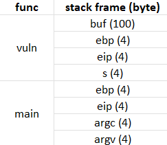
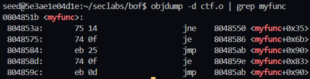
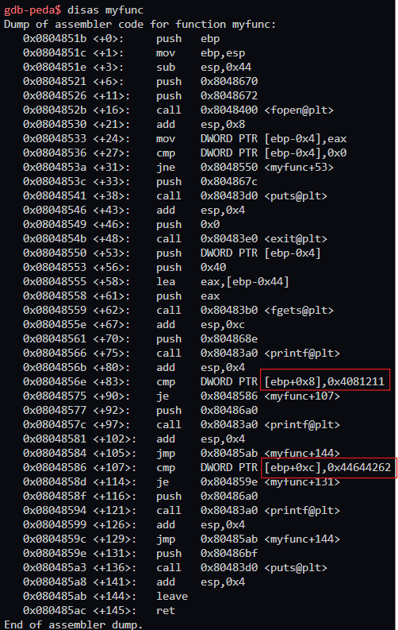
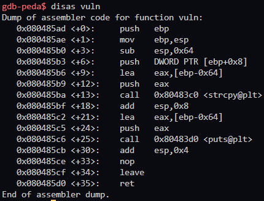

# CTF
## Interpret the attack:


### Vulnerability:
The C program contains a **buffer overflow** vulnerability in the `vuln` function due to the use of `strcpy`, which copies user input into a fixed-size buffer (`buf`) without size checks. This allows an attacker to overwrite the return address on the stack.

### Exploitation:
Force the program to execute `myfunc()` with the correct values for `p (0x04081211)` and `q (0x44644262)`

## Conducting the attack:
1. Disable stack protection
    ```
    gcc -g ctf.c -o ctf.o -fno-stack-protector -mpreferred-stack-boundary=2
    ```
2. We can get the address of `myfunc()` by an alternative way which won't load into `gdb ctf.o`
    ```
    objdump -d ctf.out | grep myfunc
    ```
   
3. Let have a brief analysis of `myfunc()` <br>
    
   <br> From here we can see that `p` and `q` is not exist in the stack frame. So the idea here is to determine exactly the location of `p` and `q` to assign directly the value of them before executing the program.
4. When a function like `vuln()` is executed, it modifies the stack structure, so we need to determine the location of `ebp` after the execution of `vuln()`.
    
    > Explaination:
    > <br>- Before `vuln()` is called, `esp` is set at the top of the stack frame for the calling function, the initial `ebp` is pushed onto the stack when `vuln()` starts
    > <br>- After `vuln()` is done, the leave instruction moves the `esp` pointer to where `ebp` was
    > <br>- The `leave` instruction pops the saved `ebp` from the stack, restoring the previous frame's base pointer, which causes `ebp` to "disappear" as `esp` points to the next address
    > <br>- After `leave`, the `ret` instruction uses the return address stored at the current location of `esp` to jump to the next function `myfunc()`,  (which is `0x0804851b`)
5. Location of `esp` when loading into `myfunc()` will be points to the saved `ebp`. Because of the return address and the arguments passed to `myfunc()` are stored higher up the stack, `p` and `q` are located at offsets of 8 and 12 bytes from `ebp` (`[ebp + 0x8]` for `p` and `[ebp + 0xc]` for `q`)
    > The location of of `p` and `q` is: ***104 + \x1b\x85\x04\x08 (ret) + 4 (s) + \x11\x12\x08\x04 + \x62\x42\x64\x44***
6. Conducting the attack
   <br>Before conducting the attack, to avoid segmentation fault
    ```
    ./ctf.o $(python -c "print('a'*104 + '\x1b\x85\x04\x08' + 'b'*4 + '\x11\x12\x08\x04' + '\x62\x42\x64\x44')")
    ```